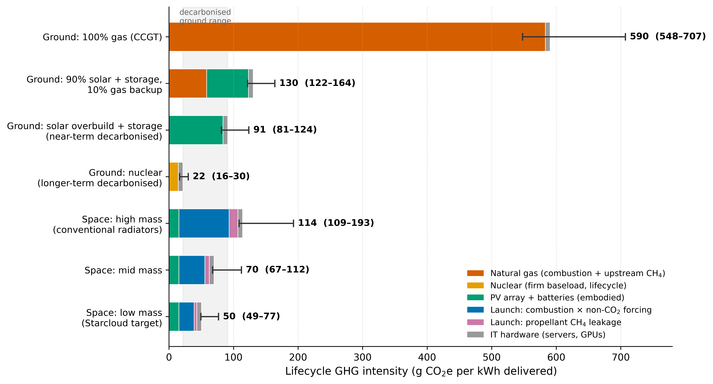

# Lifecycle greenhouse-gas emissions of space-based AI datacenters

A screening-level lifecycle greenhouse-gas (GHG) comparison of a solar-powered
orbital AI datacenter against ground-based alternatives: gas, a gas-backed solar
hybrid, fully decarbonised ground (solar overbuild plus storage, and firm nuclear),
and an orbital facility at three system-mass tiers.

The functional unit is a **1 GW IT load over a 10-year life at a 95% capacity
factor — 83.2 TWh delivered** — and every result is expressed as grams of CO₂-
equivalent per kWh delivered to the load. This is a transparent, parameter-explicit
screening estimate (roughly ±50%), not a bottom-up engineering LCA. The point is to
see which terms actually decide the comparison and how large they are, with every
input exposed in one file so it can be changed and re-run.



## Headline results

Central estimates with 5th–95th percentile ranges from a 40,000-draw Monte Carlo
over all parameters:

| Configuration | g CO₂e/kWh | Range (5–95%) |
|---|---:|---|
| Ground — 100% gas (CCGT) | 590 | 548–707 |
| Ground — 90% solar + storage, 10% gas backup | 130 | 122–164 |
| Ground — solar overbuild + storage (near-term decarbonised) | 91 | 81–124 |
| Ground — nuclear (longer-term decarbonised) | 22 | 16–30 |
| Space — high mass (conventional radiators) | 63 | 60–105 |
| Space — mid mass | 41 | 40–64 |
| Space — low mass (Starcloud target) | 31 | 31–47 |

A few things fall out of this:

- **Against gas, orbit wins by roughly 10–20×.** That result is robust to every
  assumption in the model.
- **"Decarbonised ground" is a range, not a point.** Solar overbuild plus storage
  (~91) is the near-term option; firm nuclear (~22) is the longer-term one. The
  orbital tiers (31–63) sit *inside* that range: cleaner than near-term
  solar-plus-storage at low and mid system mass, overlapping it at high mass, but
  **not** below firm nuclear, which remains the lowest-carbon option.
- **The swing variables are launch non-CO₂ forcing, system mass, and methane
  leakage** — in that order. The non-CO₂ forcing of methalox exhaust is the
  load-bearing unknown, because the soot emission index of methane-oxygen engines
  has never been directly measured.
- **The most durable advantage of orbit is not GHGs at all.** A 1 GW mostly-solar
  ground datacenter needs on the order of 160 km² of panels (more than 2.5× the
  area of Manhattan) and, if evaporatively cooled, several megatonnes of water a
  year. An orbital facility needs neither.

## Quick start

```bash
pip install -r requirements.txt

python space_dc_lca.py     # print the scenario tables, sensitivity, and Monte Carlo
python make_figures.py     # regenerate every figure into figures/ (PDF + PNG)
```

Both scripts run in a few seconds with only NumPy and Matplotlib.

## Repository layout

| Path | Purpose |
|---|---|
| `space_dc_lca.py` | **Single source of truth.** Every parameter, scenario, the radiator physics, the launch and methane terms, the break-even sweep, and the Monte Carlo live here. Change a value here and everything downstream follows. |
| `make_figures.py` | Regenerates all figures from the model into `figures/`. |
| `figures/` | All figures as vector PDF and 600-dpi PNG. |
| `METHODOLOGY.md` | Every formula, parameter, range, and citation, with the radiator-physics derivation and the reconciliation against prior published estimates. |
| `requirements.txt` | NumPy and Matplotlib. |

## How the model is organised

`space_dc_lca.py` builds each scenario from explicit parameters rather than hard-
coded intensities, so the assumptions are visible and adjustable:

- **Launch** — combustion CO₂ per kg to LEO × a non-CO₂ forcing multiplier, plus an
  additive term for methane leaked while producing the propellant.
- **Thermal management** — radiator mass is derived from the Stefan–Boltzmann law at
  GPU-compatible rejection temperatures (300–350 K), *not* imported from the very
  light high-temperature (500–1000 K) radiators in the nuclear-propulsion
  literature. This is the single correction that most affects the orbital case; see
  `METHODOLOGY.md`.
- **Power** — a dawn–dusk sun-synchronous orbit (near-continuous sunlight, small
  ride-through battery) is the baseline; a heavily eclipsed generic LEO is included
  as a sensitivity.
- **Methane leakage** — one leakage-rate parameter applied consistently to both grid
  gas and methalox propellant, at a 100-year GWP.
- **IT hardware** — carried identically on the ground and in orbit (both refresh GPUs
  on the same cadence), so it cancels in the comparison.
- **Uncertainty** — propagated by Monte Carlo, with system mass and radiator specific
  mass drawn independently so the favourable low-mass case is not implicitly paired
  with the lightest radiator.

## Figures

| File | Content |
|---|---|
| `figures/comparison.png` | Lifecycle GHG intensity by scenario, with uncertainty whiskers. |
| `figures/launch_breakeven.png` | Orbital intensity vs. effective launch GHG intensity, with the launch factor at which orbit crosses the decarbonised-ground range. |
| `figures/literature_comparison.png` | This work against published orbital estimates: Ohs et al. (2025) on a comparable basis, and the comparative conclusion of Aili et al. (2025), who use a different (life-cycle CUE) metric. |
| `figures/radiator_mass.png` | Radiator specific mass vs. rejection temperature (Stefan–Boltzmann), and the heat-pump power penalty. |
| `figures/orbit_eclipse.png` | Dawn–dusk SSO vs. generic LEO across the three mass tiers. |
| `figures/methane_leakage.png` | Sensitivity of gas and orbital intensity to the methane-leakage rate. |
| `figures/land_water.png` | Land footprint and cooling-water co-benefits. |
| `figures/sensitivity_tornado.png` | One-at-a-time sensitivity of the mid-mass orbital estimate. |

## Caveats

This is a screening-level estimate. It is meant to bound the comparison and surface
the decisive parameters, not to certify a particular number. The largest
uncertainties — the non-CO₂ forcing of methalox exhaust and the achievable system
mass — are exactly the ones least constrained by current data, and they are treated
explicitly rather than hidden. A multi-kilotonne reentry/stratospheric-metal burden
from de-orbiting at scale is a real cost that has no clean CO₂-equivalent and is
therefore discussed but not folded into the headline numbers.

## License

Released under the MIT License (see `LICENSE`).
